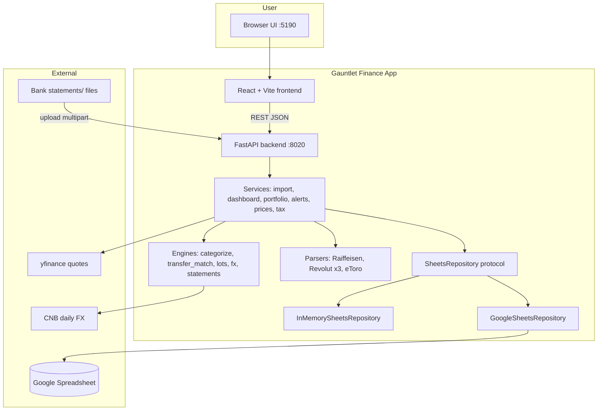
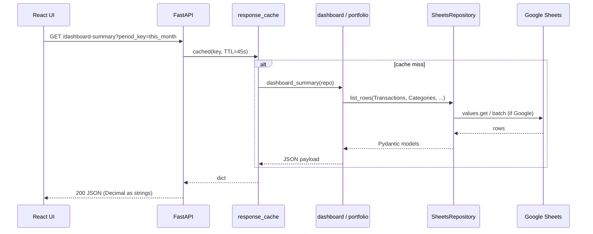
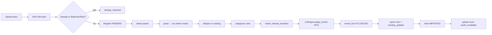

# Gauntlet Finance App — Complete Rebuild Design

| Field | Value |
|-------|--------|
| **Document** | `docs/GAUNTLET_DESIGN.md` |
| **Author** | Design (Phase 0) |
| **Date** | 2026-08-07 |
| **Status** | Approved (Phase 0 complete; implementation through frontend port — 126 pytest green) |
| **Reference** | Collective personal finance app (read-only sibling) |
| **Scope** | Full v1 rebuild under `Gauntlet Finance App/` only |
| **Rev 2** | 2026-08-07 — Issues 1–30 |
| **Rev 3** | 2026-08-07 — Issues 31–35 (alerts envelope, PR14 deps, PR count, lift list, Start-App) |

---

## Overview

Gauntlet Finance App is a complete, runnable personal multi-currency finance application. It is a **clean rebuild** of domain behaviour proven in the Collective personal finance app, with intentional product and engineering deviations (ports, packaging, category completeness, and a design→PR gauntlet process).

The system ingests **only** bank/broker statement files from `Bank statements/` (or test fixtures), stores a statements-only ledger in **Google Sheets** (service account), computes multi-currency cash analytics (USD primary, CZK secondary), FIFO investment lots with Czech 3-year (1095-day) tax-exemption tracking, and presents a dark Desk-like glass UI: executive home, spending, categorize/alerts, investments, upload, settings.

**Proposed solution:** FastAPI backend (port **8020**) + React/Vite frontend (port **5190**), layered as parsers → engines → services → Sheets repository, with InMemory repository for tests. Domain formulas and pipeline order are lifted from Collective with explicit deviations documented below.

---

## Background & Motivation

### Current state

- Collective exists and works as the reference implementation under `C:\Users\cezar\iCloudDrive\Collective personal finance app`.
- The intended Gauntlet blueprint (`docs/SOURCE_SYSTEM_REBUILD_BLUEPRINT.md`) is **missing**; requirements are reconstructed from Collective source + product-owner constraints.
- Gauntlet workspace today holds `Bank statements/` samples, `Agents.md`, and the build prompt — no application code yet.

### Pain points driving a rebuild

1. **Isolation:** Keep a clean product tree without Collective’s historical repair scripts, dual-port drift, and desk-ledger repair paths.
2. **Statements-only hard rule:** External portfolio desk imports have caused lot pollution in the past; Gauntlet must never support that path.
3. **Product clarity:** Executive home vs spending detail split; Fitness + My business categories; fixed ports 8020/5190.
4. **Process:** Incremental PR-sized delivery with adversarial design review before implementation.

### Bar to beat

| Reference | Dimension |
|-----------|-----------|
| Monzo | Clarity, mobile-first transaction UX, speed of insight |
| Sharesight | Lot-level investment tracking + tax reporting depth |
| Linear | Clean, fast, data-dense interface |
| Collective | Exact domain behaviour (statements-only, CZ tax, fee-net crypto, internal transfers) |

---

## Goals & Non-Goals

### Goals

1. **Runnable v1** with Start-App scripts, README, Sheets setup path, and fixture-based verification.
2. **Statements-only ledger** from `Bank statements/` (or test fixtures). Market data allowed: yfinance prices + CNB FX only.
3. **Multi-currency cash ledger** for CZK, USD, EUR, PLN (minimum). Display **USD primary**, **CZK secondary** (hover/tooltip).
4. **Institutions:** Raiffeisen cash; Revolut cash + stocks + crypto; eToro (account statement Excel primary).
5. **Import pipeline:** upload → SHA-256 → detect → parse → dedupe → categorize → internal transfer match → FIFO lots → persist.
6. **Czech 3-year securities exemption** (default **1095** days) on open lots and sell allocations.
7. **Revolut crypto fee-net Buys:** `qty_net = qty_gross * (1 - fees/value)`; cost basis remains `value + fees`.
8. **Digital Assets Europe** cash legs → `is_internal_transfer = true` + **Crypto funding** category.
9. **Internal transfers** never count as income/expense.
10. **UI routes** exactly as specified (executive, spending, categorize, alerts, investments, analysis, upload, settings).
11. **Default categories** include Fitness (Health) and My business (materials/filament, tools, shipping, biz other + business income).
12. **Ports:** API **8020**, UI **5190**.
13. **Tests:** pytest for core domain; frontend typecheck/build clean.

### Non-Goals (v1)

- Mobile native apps; multi-user SaaS tenancy; bank Open Banking / PSD2 APIs.
- PDF tax filing generation (JSON tax report only).
- Full double-entry general ledger / accounting package parity.
- Automatic FX conversion matching across currencies for internal transfers (same-currency only).
- Import from Portfolio Desk, broker APIs, or any non-statement ledger.
- Real-time streaming quotes; complex options/CFD modelling beyond eToro statement rows we parse.
- Changing Collective in place (Collective is read-only reference).

---

## Architecture

### System context



### Request flow (typical read)



### Import pipeline flow



Note: **lots inventory always comes from `LotEngine.apply_events`**. Parser-emitted `investment_lots` (if any) are **not** first-class persist path — Collective discards them and rebuilds from events. Cache invalidation is owned by the **upload API route**, not the pipeline service.

### Repository layout (required)

```
Gauntlet Finance App/
  backend/
    api/           # FastAPI main, routes, deps, schemas, auth
    common/        # money Decimal helpers, hashing, timeutil
    engines/       # categorize, fx, lots, statements, transfer_match
    parsers/       # detect + institution parsers
    schema/        # models, default_categories, seed_data
    services/      # import_pipeline, dashboard, portfolio_*, alerts, prices, tax, ...
    sheets/        # repository protocol, InMemory, GoogleSheets, codec
    scripts/       # seed, repair (--dry-run), setup sheet, verify
    tests/         # pytest + fixtures
  frontend/        # React + Vite (src/pages, components, api)
  docs/            # GAUNTLET_DESIGN.md, BUILD_LOG.md, reviews
  Bank statements/ # real samples / fixtures (already present)
  secrets/         # gitignored service-account.json
  .env.example
  README.md
  Start-App.bat / Start-App.ps1
```

### Layering rules

| Layer | May depend on | Must not |
|-------|---------------|----------|
| `parsers` | `schema`, `common` | services, sheets, API |
| `engines` | `schema`, `common`, other engines carefully | FastAPI, Google client |
| `services` | engines, parsers, repository protocol | UI |
| `api` | services, deps | parser internals directly |
| `sheets` | schema, codec | engines (except types) |

### Ports & process model

| Process | Port | Command pattern |
|---------|------|-----------------|
| Backend | **8020** | `uvicorn backend.api.main:app --host 127.0.0.1 --port 8020` (Start-App default bind) |
| Frontend | **5190** | Vite `server.port = 5190`, proxy `/api` → `http://127.0.0.1:8020` |

Config defaults (code, not just docs): `backend/config.py` → `api_port=8020`, `cors_origins` includes `http://localhost:5190` and `http://127.0.0.1:5190`; `frontend/vite.config.ts` → `server.port = 5190`.

**Collective ports (accurate):** `backend/config.py` defaults `api_port=8000` and CORS for **5173**; `frontend/vite.config.ts` serves UI on **5180** proxying API **8010**. README often documents 8010/5180. Gauntlet **always** defaults to **8020/5190** to avoid clash.

### Repository selection (Start-App / deps)

`api/deps.py` resolves storage as follows (**Gauntlet, not Collective demo fallback**):

| Condition | Repository / behaviour |
|-----------|------------------------|
| `pytest` / `APP_ENV=test` / explicit `REPO_BACKEND=memory` | **InMemorySheetsRepository** only |
| `AUTH_MODE=dev` + `SPREADSHEET_ID` set + credentials present | **GoogleSheetsRepository** (service account) |
| `AUTH_MODE=dev` + missing spreadsheet/credentials | **API still starts** (see Start-App path below). Repo methods that need Sheets return clear errors or empty; **never** silent InMemory demo. |
| `AUTH_MODE=oauth` | Google Sheets via user OAuth token |
| `AUTH_MODE=disabled` | Same repo resolution by spreadsheet_id; auto anonymous user |

#### Start-App first-run path (canonical — not process hard-exit)

1. **API always starts** on port 8020 (uvicorn does **not** exit solely because `SPREADSHEET_ID` is empty).
2. `GET /health` returns `status: "ok"`, `spreadsheet_configured: false`, optional `repo_backend: null` / `"unconfigured"`.
3. **Start-App.ps1 / .bat** after health check: if `spreadsheet_configured` is false, open browser to **`http://127.0.0.1:8020/setup`** (wizard), not the executive UI.
4. Frontend Settings / shell may also surface “connect spreadsheet” when `/sheets/status` or `/health` reports unconfigured.
5. **InMemory is only** for pytest and explicit `REPO_BACKEND=memory` (CI). Production Start-App must **not** seed a demo ledger in memory.
6. Optional strict mode: if `REQUIRE_SHEETS=true` (or `APP_ENV=production`) and spreadsheet/credentials missing after setup was expected, then process may exit with a clear error — **not** the default first-run path.

**Agents.md alignment:** Google Sheets is the primary store; InMemory is **only** for tests (and optional CI `REPO_BACKEND=memory`). This **deviates** from Collective’s silent InMemory when `dev` + empty `spreadsheet_id`.

### Lift policy (source of truth)

The Portfolio Formulas section is an **index and critical-path specification**, not a complete reimplementation of Collective. Implementation policy:

1. **Port verbatim (with Gauntlet package renames + golden tests)** when behaviour is non-negotiable:  
   - **Engines:** `engines/lots.py`, `engines/transfer_match.py`, `engines/fx.py`, `engines/categorize.py`, `engines/statements.py`  
   - **Parsers:** `parsers/*`  
   - **Services:** `import_pipeline.py`, `realized.py`, `statement_extras.py`, `portfolio_health.py`, `portfolio_snapshot.py`, `dashboard.py`, `prices.py`, `tax_report.py`, `lot_costs.py`, `alerts.py` (logic + response envelope), `fx_amounts.py`, `periods.py`  
   - **Schema:** `schema/models.py` field set + `SHEET_HEADERS`  
   Do **not** re-derive tax runway buckets, pace living split, yfinance symbol maps, or alert `items` envelope from formula prose alone.
2. **Port with intentional edits:** `services/categorization.py` bootstrap keywords — **strip personal PII names**; seed Digital Assets rule early; package paths; cookie/port renames in config.
3. **Re-skin / reimplement:** frontend packaging/theme, Start-App scripts, auth cookie names (`gf_*`), setup wizard copy, Gauntlet-only README.
4. **Golden tests** copied/adapted from Collective `backend/tests/*` are the parity contract. When unsure, re-read the cited Collective module.

---

## Data Model

Primary store: **Google Sheets** via service account. Tests: **InMemorySheetsRepository**. Schema mirrors Collective `backend/schema/models.py` (Pydantic v2, `extra=forbid`, Decimal money).

> **Full field set = Collective `models.py` + `SHEET_HEADERS`.** Tables below highlight non-negotiable flags and required non-optional fields; PR2 must port the complete column lists and enums, not only this summary.

### Tabs

| Tab | Purpose |
|-----|---------|
| Accounts | Institution accounts (currency, type) |
| Transactions | Multi-currency cash ledger |
| InvestmentLots | FIFO tax inventory (remaining qty + cost) |
| InvestmentEvents | Trades, staking, fees, LotAllocation children |
| Categories | Hierarchy + necessity + life_domain |
| CategoryRules | Auto-categorization rules |
| FXRates | CNB (preferred) historical rates |
| StatementFiles | Upload registry + SHA-256 idempotency |
| Settings | Key/value (exemption days, display prefs) |
| Prices | Latest yfinance quotes per ticker |

### Shared row base

Every tab row:

- `id: UUID`
- `archived: bool = false` (soft delete)
- `created_at`, `updated_at: datetime` (UTC)

### Key fields (critical)

**Transaction** (required non-optional called out; full set in Collective models)

| Field | Required | Notes |
|-------|----------|--------|
| `account_id: UUID` | yes | FK to Accounts |
| `booking_date: date` | yes | Ledger date for windows |
| `amount: Decimal` | yes | Signed; expense negative |
| `currency` | yes | ISO 4217 |
| `source_institution: str` | yes | e.g. Raiffeisen / Revolut |
| `amount_czk`, `amount_usd` | no | Converted legs |
| `fee_amount`, `fee_currency` | no | Cash fee if present |
| `merchant`, `description`, `original_description` | no | Narrative for rules/match |
| `counterparty_account`, `counterparty_name` | no | Bank transfer metadata |
| `external_id` | no | Dedupe aid |
| `is_internal_transfer` | yes (default false) | **Must exclude from income/expense** |
| `transfer_group_id` | no | Pair link |
| `category_id`, `category_override` | no | Override skips auto rules |
| `original_file_hash`, `source_file_id` | no | Provenance |
| `value_date`, `notes` | no | Optional |

**InvestmentLot**

| Field | Notes |
|-------|--------|
| `quantity_opened`, `quantity_remaining` | Inventory |
| `cost_basis_native/czk/usd` | **Remaining** total cost |
| `acquisition_date` | Start of 3y clock |
| `status` | Open / Closed / TransferredOut |
| `open_event_id` | Link to Buy/StakingReward |

**InvestmentEvent**

| Field | Notes |
|-------|--------|
| `event_type` | Buy, Sell, StakingReward, Fee, Split, Transfer, Deposit, Withdrawal, LotAllocation, … |
| `quantity`, `value_*`, `fees_*` | Trade economics |
| `parent_event_id`, `lot_id` | FIFO allocation graph |
| `realized_gain_czk/usd`, `holding_period_days`, `qualifies_3y_exemption` | On LotAllocation |

### Money representation

- **Always `Decimal`**, never float, in Python models and arithmetic.
- API JSON: serialize money as **strings** (`"1234.56"`) to avoid IEEE drift.
- Quantize: money 2 dp (`0.01`); crypto quantities up to 8 dp (`0.00000001`); ROUND_HALF_UP.
- Frontend: parse string → display; `Money` component shows USD primary + CZK tooltip.

### Default categories (must include)

Stable UUIDs (Collective pattern `c2000001-0000-4000-8000-{n:012d}`):

- **Fitness** under Health (`CAT_FITNESS`)
- **My business** parent + children: Biz materials/filament, Biz tools/equipment, Biz shipping/logistics, Biz other expenses; **Business income** under Income
- **Crypto funding** under Investments (Digital Assets Europe target)
- **Internal transfer** under Transfers (`is_transfer=true`)

Full tree: lift from Collective `backend/schema/default_categories.py`.  
**Tests must assert** Fitness + My business (+ children) + Crypto funding + Internal transfer exist after `ensure-defaults`.

### Seed CategoryRules (minimum, PR2 — not deferred to bootstrap)

Must seed **before first expenses import** (greenfield safety):

| priority | match_field | match_type | match_value | category | set_internal_transfer |
|----------|-------------|------------|-------------|---------|----------------------|
| **6** | `DESCRIPTION` | `contains` | `Revolut Digital Assets Europe Ltd` | `CAT_CRYPTO_FUND` | **true** |

Also seed generic institution transfer hints (no personal names). **Do not** copy Collective personal counterparties (e.g. owner full names).

### Seed accounts (minimum)

| Name | Institution | Type | Currency |
|------|-------------|------|----------|
| Raiffeisen CZK | Raiffeisen | Checking | CZK |
| Revolut multi-ccy | Revolut | Checking | USD (map multi-ccy via account_ids) |
| Revolut Crypto | Revolut | Crypto | USD |
| Revolut Stocks | Revolut | Investment | USD |
| eToro | eToro | Investment | USD |

### Migration strategy

- v1: `ensure-tabs` creates empty headers if missing; no schema version table.
- Column additions: append columns; readers tolerate missing optional fields via Pydantic defaults.
- Destructive rebuild: repair scripts with `--dry-run` first (lots from events, digital assets, transfer flags).

---

## Import Pipeline

**Canonical service:** `ImportPipeline.upload` (Collective: `backend/services/import_pipeline.py`).

### Stages

| # | Stage | Owner | Behaviour |
|---|--------|-------|-----------|
| 1 | **Hash** | pipeline | `SHA-256` of raw bytes (`StatementService.content_hash`) |
| 2 | **Idempotency** | pipeline | If hash exists in `StatementFiles` → `status=already_imported`, no re-write |
| 3 | **Accounts bootstrap** | pipeline | If Accounts empty → `seed_minimal` (or Gauntlet equivalent) so `account_ids` map is stable |
| 4 | **Register** | pipeline | Insert `StatementFile` PENDING |
| 5 | **Detect** | pipeline | Header/content sniff → `ParserKey` (`parsers/detect.py`); **only allowlisted ParserKeys** (statements-only) |
| 6 | **Parse** | pipeline | Institution parser → `ParseResult` (transactions and/or investment **events**; optional parser lots discarded later) |
| 7 | **Dedupe** | pipeline | Drop rows already present (external_id / composite keys) |
| 8 | **Categorize** | pipeline | `CategoryEngine` + rules; `set_internal_transfer` rules apply (Digital Assets must already be seeded) |
| 9 | **Transfer match** | pipeline | `match_internal_transfers` on **existing ∪ new**; updates both new rows and **existing** rows that gain flags |
| 10 | **FIFO lots** | pipeline | `LotEngine.apply_events(existing_lots, new_events)` with FX; **skip re-fed LotAllocation** events; **ignore `parsed.investment_lots`** |
| 11 | **Enrich costs** | pipeline | `enrich_lots` fills cost_basis_usd/czk; may fetch CNB rates |
| 12 | **Persist** | pipeline | `upsert_rows`: new txs, **existing_updates** (transfer flags), events, lots; mark StatementFile IMPORTED |
| 13 | **Cache invalidate** | **upload route** | `cache_invalidate()` + `repo.invalidate_cache()` if present — **not** inside `ImportPipeline.upload` |

### Parser coverage (allowlist — statements-only)

| Parser key | File type | Output used by pipeline |
|------------|-----------|-------------------------|
| `raiffeisen_cz` | CSV | Transactions |
| `revolut_expenses` | CSV | Transactions |
| `revolut_crypto` | CSV | InvestmentEvents (fee-net buys); lots via LotEngine |
| `revolut_stocks` | CSV | InvestmentEvents (incl. splits); lots via LotEngine |
| `etoro_account_statement` | XLSX multi-sheet | InvestmentEvents (+ cash legs as parser emits) |
| `etoro_activity` | CSV legacy | InvestmentEvents |

No desk/portfolio/TSV importers. Unknown format → ERROR status.

**Fixture / sample files** (already under Gauntlet `Bank statements/`):

- `RB statemtn beginning to now.csv`
- `revolut daily expenses all.csv`
- `All time crypto revolut.csv`
- `All time stocks revolut.csv`
- `etoro-account-statement-1-1-2021-8-5-2026.xlsx`
- `Revolut audit recheck for doge and xrp.csv` (fee-net audit)

### Digital Assets Europe (non-negotiable)

Cash legs for Revolut Current ↔ **Digital Assets Europe** fund crypto buys / return sell proceeds. Trade economics live only in crypto **InvestmentEvents** — cash legs must **not** count as income/spend.

**Exact seed rule** (port Collective `categorization.py` Digital Assets constants; seed in **PR2** `seed_data` / ensure-defaults — do **not** wait for bootstrap):

| Field | Value |
|-------|--------|
| `priority` | **6** (lower number wins) |
| `match_field` | `MatchField.DESCRIPTION` |
| `match_type` | `MatchType.CONTAINS` |
| `match_value` | `Revolut Digital Assets Europe Ltd` |
| `category_id` | `CAT_CRYPTO_FUND` |
| `set_internal_transfer` | **true** |
| `is_active` | true |

**Repair path** (`repair_revolut_digital_assets_transfers --dry-run`):

- Detection: `is_revolut_digital_assets_transfer` scans **full narrative blob** (merchant + description + original_description + counterparty + notes), needle `revolut digital assets europe` (case-insensitive) — **not** description-only.
- Rewrites matching txs to Crypto funding + `is_internal_transfer=true` (skip `category_override` by default).
- Ensures rule exists/updated if missing.

Greenfield imports of Revolut expenses **before** this rule would mis-classify pot legs as spend — hence seed in PR2.

### Internal transfer matcher (full precision gates)

**Mandate:** Port Collective `engines/transfer_match.py` verbatim (+ `test_transfer_match.py` golden cases). Summary below is the contract; do not implement from four bullets alone.

**Config defaults** (`TransferMatchConfig`):

| Param | Default |
|-------|---------|
| `date_window_days` | 3 |
| `amount_abs_tolerance` | `Decimal("0.50")` |
| `amount_rel_tolerance` | `Decimal("0.002")` (0.2%) |
| `min_auto_score` | 70 |
| `require_keyword_or_exact_amount` | **True** |

**Hard constraints** (return `None` = no candidate):

1. Different `account_id`; same currency; outflow amount &lt; 0 and inflow &gt; 0  
2. Neither side already has `transfer_group_id`; neither archived  
3. Amounts close per abs/rel tol; `|date gap| ≤ 3`  
4. Cross-institution with **no** strong hint and **no** transferish wording → reject  
5. Non-exact amount without strong hint and without preflagged internal → reject  
6. If `require_keyword_or_exact_amount`: need **strong** own-account hint **OR** preflagged `is_internal_transfer` **OR** (exact amount **AND** transferish wording)  
7. Card-merchant coincidence: if not strong and not preflagged, and either side has a non-empty merchant outside `{revolut, transfer}` and neither is transferish → reject (e.g. Spotify vs random inflow)

**Scoring** (after hard pass; base 40):

| Condition | Delta |
|-----------|-------|
| Exact amount | +30 else +10 |
| Same day / 1 day / else | +15 / +10 / +5 |
| Strong own-account hint | +20 |
| Else transferish wording | +8 |
| Either side already `is_internal_transfer` | +10 |

Auto-link only if `score ≥ min_auto_score` (70). Greedy highest-score first; each tx used once. On match: both legs `is_internal_transfer=true` + shared `transfer_group_id`.

**Strong hints / transferish:** regexes from Collective (`_HINT_RE`, `_TRANSFERISH_RE`, institution cross, merchant == `revolut` on bank statements). Port verbatim.

### Error handling

- Parse failure → StatementFile `ERROR` + notes; no partial silent success for that file.
- Max upload size: **50MB**.
- Content-type / extension allowlist: `.csv`, `.xlsx` (and `text/csv`, Excel MIME); reject others with 400.
- Always return structured `UploadSummary` / `UploadResponse` (full fields — see API Surface).

---

## Portfolio Formulas

**Purpose:** Critical-path formulas for review and tests. **Source of truth for full behaviour = Collective modules listed under Lift policy.** Engineers should port those modules and use golden tests; re-read Collective when edge cases arise.

### Exemption days source of truth

- Process config: `Settings.holding_period_exemption_days` (env, default **1095**).  
- Injected into `ImportPipeline`, `LotEngine`, `dashboard_summary`, `portfolio_snapshot`, tax routes via FastAPI `SettingsDep`.  
- Optional Settings **tab** key for display/ensure-defaults documentation; v1 runtime authority is **env/config at process start** (restart to change). Matches Collective route pattern.

### 1. Revolut crypto fee-net quantity

**Source:** `parsers/revolut_crypto.py` → `net_revolut_crypto_buy_quantity`

```
qty_net = qty_gross * (1 - fees / value)
```

**Guards (must match Collective tests):**

| Condition | Result |
|-----------|--------|
| `qty_gross ≤ 0` | return gross, rate `None` |
| `value is None or value ≤ 0` | return gross, rate `None` |
| `fees < 0` | treat fees as 0 |
| `fee_rate ≤ 0` | return gross, rate 0 |
| `fee_rate ≥ 1` | **pathological — leave gross**, rate `None` (do not zero inventory) |
| else | apply fee-net |

- **Cost basis** for lot open: `cost_native = value + fees` (not reduced by fee-net).
- Tag notes: `revolut_buy_fee_net; gross_qty=…; fee_rate=…`.
- Fee-net affects **units / MV only**; living-draw cash uses `value_usd` notional (see extras).

### 2. Lot open cost

**Source:** `engines/lots.py` → `LotEngine._open_from_event`

```
cost_native = abs(value_native) + abs(fees_native)   # Buy / open
# StakingReward: cost_native = value or 0 (zero-cost inventory when empty)
quantity_opened = quantity_remaining = qty  # fee-net qty for Revolut crypto buys
```

Convert remaining cost to CZK/USD via `FXService.convert` on `acquisition_date`.

### 3. FX conversion

**Source:** `engines/fx.py` → `FXService.convert` / `rate_for`

- Rate storage: **quote units per 1 base** (CNB: CZK per 1 USD/EUR/…).
- Lookup: preferred source CNB; lookback up to ~14 days for weekends/holidays.
- Cross via CZK when needed.
- Missing rate → `None` (caller skips or leaves unconverted).

```
amount_to = amount_from * factor(from_ccy → to_ccy, on=date)
```

### 4. FIFO sell allocation

**Source:** `LotEngine._allocate_sell`

For sell quantity `qty_need`, open lots ordered by `(acquisition_date, id)` (account-scoped first):

```
net_proceeds = value_native - abs(fees_native)
for each lot until qty_need satisfied:
  take = min(lot.quantity_remaining, remaining)
  frac_lot = take / lot.quantity_remaining
  cost_* = lot.cost_basis_* * frac_lot          # 2 dp money
  frac_sell = take / qty_need
  proc_share = net_proceeds * frac_sell
  gain_czk = proc_czk - cost_czk
  gain_usd = proc_usd - cost_usd
  holding_period_days = sell_date - lot.acquisition_date
  qualifies_3y_exemption = holding_period_days >= exemption_days  # default 1095
  reduce lot remaining qty and cost; close if rem == 0
  emit LotAllocation child event
```

Specific lot: if `sell.lot_id` set, only that lot is candidate.

**Shortfall (parity):** if open lots cannot cover `qty_need`, allocate what is available and **leave remainder unallocated with no error** (silent partial allocation). Do not invent shortfall exceptions unless documented later as a BUILD_LOG deviation.

### 4b. Fee capitalization

**Source:** `LotEngine._apply_fee`

- On `InvestmentEventType.FEE`, resolve target lot via `parent_event_id` → buy-event-to-lot map, else `fee.lot_id`.
- If lot is still **Open**:  
  `fee_abs = abs(fee.value_native or fee.fees_native or 0)`  
  Convert via `_enrich_cost` on fee date (respect fee’s native currency if different from lot).  
  Add to remaining `cost_basis_native/czk/usd` (money quantize 2 dp / ROUND_HALF_UP as in engine).
- Link fee row’s `lot_id` / `parent_event_id`. Does not change quantity.

### 5. Split handling

**Source:** `LotEngine._apply_split`

- `quantity` is **signed share delta** (Revolut style), not absolute post-split total.
- `current_total = sum(open lot qty for ticker [source-filtered])`
- `target = current_total + split.quantity`  (signed delta)
- `ratio = target / current_total`
- `scale_cost = (split.quantity < 0)`  # reverse only
- Forward (`qty > 0`): scale quantities by ratio; **total cost unchanged**.
- Reverse (`qty < 0`): scale quantities **and** cost by ratio.
- Prefer lots matching `split.source` broker when set.
- If `target ≤ 0`: close open lots (qty/cost zero).

### 6. Legal-entity transfer (no inventory exit)

**Source:** `LotEngine._is_inventory_exit_transfer`

Revolut “Trading Ltd → Securities Europe UAB” style transfers: **do not** reduce lots (preserve acquisition dates for 3y test). Only explicit outbound wording reduces inventory (`TransferredOut`, no realized gain).

### 7. Tax-free eligibility on open lots

**Source:** `LotEngine.summarize_ticker`

```
held = as_of - acquisition_date   # days
tax_free_on = acquisition_date + timedelta(days=exemption_days)
qualifies = held >= exemption_days
quantity_tax_free = sum(qty of open lots where qualifies)
quantity_pending = total_quantity - quantity_tax_free
```

### 8. Position market value & unrealized

**Source:** `services/portfolio_snapshot.py` → `portfolio_snapshot`

```
MV_ticker = quantity * Prices.price   # as stored — NO FX conversion of Price.currency in snapshot
unrealized_ticker = MV - cost_basis_usd
total_MV = sum(MV) if any prices else null
unrealized_total = total_MV - total_cost
unrealized_pct = (unrealized_total / total_cost) * 100   # if total_cost > 0
```

**Parity note:** Collective multiplies by `px.price` with no currency conversion. Therefore **`PriceService.refresh_and_store` must write USD quotes** (or convert to USD before persist). yfinance symbol mapping (crypto suffixes, etc.) lives in `services/prices.py` — port that mapping; surface `missing_quotes` when absent.

### 9. Tax runway buckets

**Source:** `portfolio_snapshot` bucket_defs

Per open lot value (`qty * price` else USD cost):

| Key | Condition |
|-----|-----------|
| `now` | `tax_free_on <= as_of` |
| `later_this_year` | free in current calendar year after as_of |
| `next_year` | free year = as_of.year + 1 |
| `year_after` | free year ≥ as_of.year + 2 |

### 10. Living draw (12m cash)

**Source:** `statement_extras.compute_living_draw_12m`

```
sold = sum(abs(value_usd) for Sell in window if value_usd present and abs > 0)
bought = sum(abs(value_usd) for Buy in window if value_usd present and abs > 0)
draw_usd = sold - bought
```

- **Missing / null / zero `value_usd` contributes 0** (silently understates draw if FX legs never filled).
- Ensure parsers set native value and pipeline/FX fill `value_usd` on trades.
- Exclude StakingReward, LotAllocation, Fee from draw. Window default **365** days (`as_of - 365` … `as_of`).

### 11. Cumulative reinvestment rate

**Source:** `compute_cashflow_monthly`

Per month and cumulatively (same missing-USD → 0 rule as living draw):

```
reinvestment_rate_pct_month = (bought / sold) * 100          # if sold > 0 else null
cumulative_reinvestment_rate_pct = (cum_invested / cum_proceeds) * 100  # if cum_proceeds > 0
```

Prefer **cumulative** curve in Analysis UI (stable vs monthly spikes).

### 12. Fees summary

**Source:** `compute_fee_summary`

```
trade_fees = sum(fees on Buy/Sell)
explicit = sum(Fee events)
total_fees = trade_fees + explicit
```

Include Revolut Metal ~0.99% service fees from `fees_usd` on buys.

### 13. Staking summary

**Source:** `compute_staking_summary`

- Sum StakingReward units; mark USD from broker `value_usd` else `qty * live_price`.
- Zero cost basis on lots; **does not** inflate living-draw reinvested.

### 14. Portfolio health score

**Source:** `portfolio_health.compute_portfolio_health`

Start at **100**, clamp 0–100. Grades: A≥80, B≥65, C≥50, else D.

Penalties (summary):

| Signal | Threshold | Score delta |
|--------|-----------|-------------|
| Single-name weight | >35% / >25% | −18 / −10 |
| Top-3 weight | >70% / >55% | −12 / −6 |
| Crypto weight | >50% / >30% | −15 / −8 |
| Tax-free basis % of open cost | <10% / <25% | −14 / −7 |
| Early (taxable-window) sales | >40% of realized with gains | −10 |
| Speculative sleeve (DOGE, ENJ, ACHR, NNE, QS) | >25% | −8 |

HHI = sum of squared weights. Issues list includes “good” positives.

### 15. Lot cost enrichment

**Source:** `lot_costs.resolve_lot_costs` / `enrich_lots`

Prefer convert `cost_basis_native` on `acquisition_date` to CZK and USD; fix zero placeholder converted legs.

### 16. Cash dashboard (exclude internals)

**Source:** `dashboard._cashflow_window`

```
if is_internal_transfer: skip  # not income, not expense
if signed_usd > 0: income += signed
if signed_usd < 0: expense += abs(signed)
net = income - expense
```

### 17. Pace strip

**Source:** `dashboard_summary` pace block (exact offsets)

```
d30_from  = today - timedelta(days=29)     # inclusive window length 30 days
d180_from = today - timedelta(days=179)    # inclusive window length 180 days
spend_30d = expenses in [d30_from, today]  # exclude is_internal_transfer
spend_180 = expenses in [d180_from, today]
avg_monthly_6m = spend_180 / Decimal("6")
pace_pct = pct_change(spend_30d, avg_monthly_6m)
living_30 = max(spend_30 - investment_domain_30, 0)
```

Investment domain expenses split via `_expense_split_in_window` so “living” pace is visible. Do **not** write unit tests assuming “180 calendar days” without the 179 offset.

### 18. Realized gains (tax report) + ghost dedupe

**Source:** `tax_report.build_tax_report` + `realized.iter_unique_allocations` / `sum_realized_usd`

- Sum LotAllocation rows in tax year; split exempt vs taxable by `qualifies_3y_exemption`.
- **Ghost double-write dedupe** (`iter_unique_allocations`): keep one allocation per key  
  `(parent_event_id, quantity, realized_gain_usd, ticker)`  
  Prefer newest `updated_at` / `created_at` when ties exist. Port `realized.py` verbatim.

---

## API Surface

Base: FastAPI on **:8020**.

### Auth modes & user resolution

| `AUTH_MODE` | Browser login | `require_user` behaviour |
|-------------|---------------|---------------------------|
| `dev` (default) | No | Auto `SessionUser` `dev@localhost` (Collective parity) |
| `disabled` | No | Auto anonymous user |
| `oauth` | Yes | Requires session; unauthenticated → 401 |

**Cookie names (KD):** session cookie `gf_session` (settings `session_cookie_name`); oauth CSRF state cookie `gf_oauth_state` (rename from Collective `cf_*` to avoid clash). CORS allowlist includes 5190 origins.

**Decimal JSON:** response money fields are **strings**; FastAPI routes return `dict` with `str(Decimal)` or Pydantic models that serialize Decimal as string — document in `api/schemas.py` and frontend `api/types.ts`.

### Core routes

#### Health / auth / setup / sheets

| Method | Path | Purpose |
|--------|------|---------|
| GET | `/health` | Liveness; `auth_mode`, `spreadsheet_configured` |
| GET | `/auth/login` | OAuth start (or stub message in `dev`) |
| GET | `/auth/callback` | OAuth callback |
| GET | `/auth/me` | Session / auto-dev user |
| POST | `/auth/logout` | Clear session cookie |
| GET | `/setup` | HTML wizard |
| GET/POST | `/setup/api/*` | status, upload-credentials, save-spreadsheet, test-connection, ensure-tabs |
| GET | `/sheets/status` | Connection / tab health |
| POST | `/sheets/reload` | Drop Sheets tab cache |

#### Import / cash / dashboard

| Method | Path | Purpose |
|--------|------|---------|
| POST | `/upload` | Multipart statement import |
| GET | `/transactions` | Filtered cash txs |
| GET | `/dashboard-summary` | Cash + portfolio compact + pace |
| GET | `/alerts` | Alert cards with `href` drill-downs |

#### Investments / prices / tax

| Method | Path | Purpose |
|--------|------|---------|
| GET | `/investments/snapshot` | Full portfolio + extras + health |
| GET | `/investments/ticker-digests` | Per-ticker verification |
| GET | `/investments` | Event list |
| GET | `/lots` | Open lots + eligibility |
| POST | `/prices/refresh?force=` | yfinance refresh + cache bust |
| GET | `/tax-report?year=` | JSON tax payload |

#### Categories (Categorize UX — complete set)

| Method | Path | Purpose | Cache |
|--------|------|---------|-------|
| GET | `/categories` | List | — |
| POST | `/categories` | Create | invalidate |
| PATCH | `/categories/{category_id}` | Update | invalidate |
| DELETE | `/categories/{category_id}` | Soft-delete | invalidate |
| POST | `/categories/ensure-defaults` | Seed Fitness + My business + seed rules | invalidate |
| GET | `/categories/coverage` | Categorization coverage stats | — |
| GET | `/categories/merchant-queue` | Uncategorized merchant buckets | — |
| POST | `/categories/merchant-queue/apply` | Apply category + optional rule | **full** invalidate |
| POST | `/categories/bootstrap-rules` | Keyword bootstrap (**no PII**) | invalidate |
| POST | `/categories/apply-rules` | Re-run rules on txs | invalidate |
| POST | `/categories/apply-match` | Apply single match pattern to txs | invalidate |
| POST | `/categories/{category_id}/override` | Manual override one tx (`transaction_id`) | **full** invalidate |
| POST | `/categories/bulk-override` | Manual override many txs | **full** invalidate |
| GET/POST/PATCH/DELETE | `/category-rules` | Rule CRUD | invalidate on mutate |

**Override shapes (Collective parity):**

```
POST /categories/{category_id}/override
  body: { "transaction_id": UUID }
  → { "transaction_id", "category_id", "category_override": true }

POST /categories/bulk-override
  body: { "category_id": UUID, "transaction_ids": [UUID, ...] }
  → { "category_id", "updated", "missing", "transaction_ids": [...] }

POST /categories/apply-match
  → ApplyMatchResult: scanned, matched, updated, skipped_override, skipped_already,
     mode, category_id, match_field, match_type, match_value
```

#### Admin (prefix `/admin` — Collective parity)

| Method | Path | Purpose |
|--------|------|---------|
| GET | `/admin/cleanup/preview` | Preview cleanup |
| GET | `/admin/cleanup/scopes` | Scope list |
| POST | `/admin/cleanup` | Run cleanup |
| POST | `/admin/warm-cache` | Warm caches |
| POST | `/admin/backfill-fx` | Long-running FX backfill job |
| POST | `/admin/fetch-cnb` | Fetch CNB rates |
| GET | `/admin/jobs/{job_id}` | Poll long-running job status |

Do **not** mount cleanup/backfill at bare `/cleanup` paths.

### Key query/response shapes

**`GET /dashboard-summary`**

```
?date_from&date_to&currency&period_key=
  this_month|last_month|last_30d|last_6m|this_year|last_year|all_time|custom|calendar_month

{
  "filters": {...},
  "cashflow": {
    "income_usd", "expense_usd", "net_usd",
    "income_czk", "expense_czk", "net_czk",
    "by_currency": [...], "top_expense_merchants": [...],
    "internal_transfer_count", "unconverted_count"
  },
  "comparison": { "income_change_pct", "expense_change_pct", ... } | null,
  "pace": {
    "spend_30d_usd", "avg_monthly_6m_usd", "pace_pct",
    "spend_30d_living_usd", "pace_pct_living", ...
  },
  "spending": { "by_category", "by_domain", "by_necessity", "uncategorized_pct" },
  "portfolio": { "total_market_value", "unrealized_usd", "tax_free_now_usd", ... },
  "portfolio_compact": {...},
  "portfolio_health": { "score", "grade", "summary", "issues", "concentration" }
}
```

**`POST /upload` → UploadResponse** (full Collective shape)

```
{
  "status": "imported" | "already_imported" | "error",
  "content_sha256": "...",
  "parser_key": "revolut_crypto" | null,
  "institution": "Revolut" | null,
  "statement_file_id": "uuid" | null,
  "rows_parsed": N,
  "transactions_written": N,
  "events_written": N,
  "lots_written": N,
  "transfer_pairs_linked": N,
  "transactions_deduped": N,
  "events_deduped": N,
  "message": "ok",
  "errors": []
}
```

**`POST /prices/refresh`**

```
{
  "as_of": "ISO datetime",
  "quote_count": N,
  "total_market_value_usd": "…",
  "quotes": [{ "ticker", "price", "currency", "as_of", "source" }],
  "positions": [...],
  "errors": []
}
```

**`GET /alerts`** — Collective envelope (do **not** use key `alerts`)

```
{
  "items": [
    { "id", "level": "danger|warn|info", "title", "body", "href" }
  ],
  "warn_count": N,    // count of level in {"warn", "danger"}
  "danger_count": N,  // count of level == "danger"
  "total": N          // len(items)
}
```

Frontend (`AlertsResponse` / `AlertsPage` / Layout badge) must consume **`items`**, `warn_count`, `danger_count`, `total` — parity with Collective `build_alerts` return dict. Port `services/alerts.py` return shape verbatim.

#### Alert catalog (port `services/alerts.py`)

| id | level (exact) | Trigger (summary) | href pattern |
|----|---------------|-------------------|--------------|
| `pace_far_above_avg` | danger | 30d spend &gt;50% above 6m monthly avg | categorize `date_from=d30` expenses_only hide_transfers |
| `pace_above_avg` | warn | 30d &gt;15% above avg | same |
| `large_outflow` | info | Single outflow &gt;25% of 30d spend | categorize window + optional `q` merchant |
| `fixed_this_month` | info | Large fixed-necessity spend this month | life_domain / category filters |
| `unconverted_fx` | warn | Transactions missing USD conversion | `unconverted=1` |
| `uncategorized_high` | **danger** | Uncategorized/Other share of 30d expense **≥40%** | `category_id=uncategorized` + dates |
| `uncategorized_pct` | warn | Uncategorized share **≥20%** and &lt;40% | same |
| `tax_unlocks_90` | info | Lots unlock tax-free within 90d | (may link investments or categorize) |
| `tax_unlocks_180` | info | Lots unlock within 180d | same |
| `missing_prices` | warn | Open tickers without Quotes | investments |
| `domain_spike_{domain}` | warn | Life-domain spend spike vs baseline | `life_domain=` + dates |
| `transfer_leak` | warn | Transfer-like narrative still counting as spend | `filter=transfer_leak` or `q=` |

`href` builder (`_cat_url`): `/expenses/categorize?` + `urlencode` of `date_from`, `date_to`, `expenses_only=1`, `hide_transfers=1`, `category_id`, `q`, `life_domain`, `unconverted=1`, `filter`. Port builder verbatim.

### Caching policy

| Mutation | Server invalidate |
|----------|-------------------|
| Upload | **Full** `cache_invalidate()` + `repo.invalidate_cache()` |
| Category override / bulk / apply-rules / apply-match / merchant-queue apply | **Full** response cache |
| Price refresh | Prefixes only: `snap:`, `dash:`, `ticker-digests:` |
| Cleanup / admin | Full or scoped as Collective |

| Key prefix | TTL | Notes |
|------------|-----|-------|
| `dash:` | ~45s | |
| `alerts:` | ~60s | |
| `snap:`, `ticker-digests:` | ~45s | |
| Sheets tab cache | process lifetime | `/sheets/reload`, upload |

**Client after price refresh:** Layout dispatches `prices-updated`. **Must listen:** Executive (`/`), Holdings (`/investments`), digests consumers, Analysis if showing MV. Spending page optional (cash-only). Clear any client-side snapshot memo on event.

**Critical:** Never persist full Transactions FX backfill on GET paths (Collective lesson: multi-minute freezes).

---

## Frontend IA

**Stack:** React + Vite + TypeScript + Tailwind; dark glass theme (Desk-like).

### Routes (exact)

| Route | Page | Behaviour |
|-------|------|-----------|
| `/` | Executive snapshot | Portfolio health grade + wealth KPIs (MV, cost, unrealized, tax-free now) + cash month steppers (income/expense/net) + alert strip. **Not** deep spend charts. Listens for `prices-updated`. |
| `/expenses/spending` | Spending | Order: **timeframe picker → category chart → net/income/expense KPIs → 30d pace**. Drill to categorize with filters. **Acceptance:** internal transfers excluded from charts/KPIs; Money shows USD primary + CZK tooltip; empty state when no txs. |
| `/expenses/categorize` | Categorize | Tx table; rules panel; merchant queue; URL query filters; sticky filter banner; honor `panel=rules`; uses override/bulk-override/apply-match APIs. |
| `/expenses/alerts` | Alerts | Cards with working `href` drill-downs (full alert catalog). |
| `/investments` | Holdings | **Verify holdings first** (ticker digests / qty sanity), then KPIs + tax runway buckets. Listens for `prices-updated`. |
| `/investments/analysis` | Analysis | Health detail, buy vs sell cash, **cumulative reinvest %**, fees, staking. Refetch MV-related on `prices-updated` if shown. |
| `/upload` | Upload | Drag/drop statements; show full UploadResponse fields (institution, rows_parsed, statement_file_id, dedupe counts). |
| `/settings` | Settings | Sheets status, exemption days display, ensure-defaults, connection help; surfaces when spreadsheet not configured. |

**Legacy redirects** (preserve query string):

- `/expenses/transactions` → `/expenses/categorize`
- `/expenses/categories` → `/expenses/categorize?panel=rules`
- `/transactions`, `/categories`, `/alerts` → equivalents under `/expenses`

### Navigation

- Desktop sidebar: Dashboard; Expense tracking group (Spending, Categorize, Alerts badge); Investments group (Holdings, Analysis); Upload; Settings.
- Mobile bottom bar: Dashboard, Expenses, Investments, Upload, Settings.
- **Price refresh** button in Layout:
  1. `POST /prices/refresh?force=true`
  2. Backend invalidates `snap:`, `dash:`, `ticker-digests:` only (not full cache)
  3. `window.dispatchEvent(new CustomEvent("prices-updated", { detail: { quote_count, as_of } }))`
  4. **Listeners:** Executive Home, Investments Holdings (digests/snapshot), Analysis if MV shown — each clears local memo and refetches. Do not require full page reload.

### Auth UX (dev)

- `AUTH_MODE=dev` / `disabled`: no LoginPage gate; AuthContext treats `/auth/me` auto-user as logged in.
- `oauth`: show LoginPage when unauthenticated; `/auth/login` + callback flow.

### Money UX

- Primary: USD.
- Secondary: CZK on hover/tooltip (`Money` component).
- Never show internal transfers in spend charts or spending KPIs.

### Theme

- Dark background, translucent glass cards, subtle borders, brand accent for active nav.
- Dense but readable tables (Linear-like); clear hierarchy (Monzo-like insight speed on Home).

---

## Key Decisions

| # | Decision | Rationale |
|---|----------|-----------|
| KD-1 | **Google Sheets primary store** | Multi-device access, human-auditable ledger, no DB ops for personal app; proven in Collective. |
| KD-2 | **InMemory only for tests / `REPO_BACKEND=memory`** | Agents.md; API always starts; unconfigured Sheets → `/health` `spreadsheet_configured:false` + Start-App opens `/setup`. **No** silent InMemory demo. Optional `REQUIRE_SHEETS=true` for strict exit. |
| KD-3 | **Statements-only data rule + ParserKey allowlist** | No desk/portfolio importers in tree; detect only allowlisted keys. yfinance/CNB allowed as non-ledger feeds. |
| KD-4 | **Decimal everywhere for money; API money as strings** | Correct multi-currency + FIFO basis; avoid JSON float bugs. |
| KD-5 | **FIFO default; optional specific lot_id** | Czech inventory practice; Share-sight-like lot depth. |
| KD-6 | **1095-day exemption via config env** | Product owner CZ rule; `holding_period_exemption_days` at process start; inject into engines/routes. |
| KD-7 | **Fee-net crypto qty at parse time** | Matches Revolut app balances; cost still full fiat paid; pathological fee_rate≥1 leaves gross. |
| KD-8 | **Digital Assets Europe seed rule priority 6 in PR2** | Cash pot moves internal + Crypto funding before first import; repair scans full narrative. |
| KD-9 | **Transfer matcher: port verbatim precision gates** | `require_keyword_or_exact_amount`, card-merchant reject, score≥70; false positives destroy spend accuracy. |
| KD-10 | **USD display primary / CZK secondary** | User mental model for investments + CZ tax reporting. |
| KD-11 | **Ports 8020 / 5190 as code defaults** | `config.api_port=8020`, vite `5190`; avoid Collective 8000/8010/5173/5180 clash. |
| KD-12 | **Short TTL response cache + typed invalidate** | Full invalidate on upload/categorize mutates; prefix invalidate on price refresh. |
| KD-13 | **No FX backfill persist on GET** | Operational correctness under ~10k+ transactions. |
| KD-14 | **Stable category UUIDs + Fitness/My business tests** | Idempotent ensure-defaults; pytest asserts required categories. |
| KD-15 | **Service account `AUTH_MODE=dev` + auto-user** | Personal single-user; setup wizard for credentials; no browser login required. |
| KD-16 | **Port engines/parsers/services per Lift policy; re-skin packaging/UI** | Verbatim list includes portfolio_snapshot, dashboard, prices, tax_report, lot_costs, statements, alerts envelope; golden tests; no PII keyword port. |
| KD-17 | **Session cookie `gf_session` / state `gf_oauth_state`** | Avoid clash with Collective `cf_*` cookies on same machine. |
| KD-18 | **Admin routes under `/admin/*`** | Collective parity for ops scripts. |
| KD-19 | **Lots only from LotEngine** | Ignore parser-emitted lots at persist; skip re-fed LotAllocation. |
| KD-20 | **Bootstrap keywords: institution-generic only** | Never ship personal names from Collective `_KEYWORD_RULES`. |

---

## Alternatives Considered

### A1. Storage

| Option | Pros | Cons | Verdict |
|--------|------|------|---------|
| **Google Sheets (chosen)** | Auditable, multi-device, no DB | Latency, row limits, API quotas | **Chosen** |
| SQLite/Postgres | Faster queries, real constraints | Ops burden, less user-visible audit | Reject v1 |
| Local JSON files | Simple | Weak multi-device, merge pain | Reject |

### A2. Import source

| Option | Pros | Cons | Verdict |
|--------|------|------|---------|
| **Statements only (chosen)** | Single source of truth | Manual export step | **Chosen** |
| Desk ledger + statements | Fast bootstrap | Double counts, lot pollution (historical incident) | **Forbidden** |
| Open Banking APIs | Automatic | Complexity, credentials, bank coverage | Non-goal |

### A3. Crypto fee handling

| Option | Pros | Cons | Verdict |
|--------|------|------|---------|
| **Fee-net qty (chosen)** | Matches app balances | Must document cost vs qty | **Chosen** |
| Gross qty + fee as expense only | Simpler | Holdings diverge from Revolut | Reject |
| Separate fee-only lots | Accounting pure | Overfit | Reject |

### A4. Frontend framework

| Option | Pros | Cons | Verdict |
|--------|------|------|---------|
| **React + Vite (chosen)** | Collective parity, ecosystem | — | **Chosen** |
| Next.js SSR | SEO | Unnecessary for local personal app | Reject |
| Streamlit | Fast prototype | Not Linear/Monzo quality IA | Reject |

### A5. Lot costing method

| Option | Pros | Cons | Verdict |
|--------|------|------|---------|
| **FIFO + optional lot_id (chosen)** | CZ inventory practice; Collective parity | Slight complexity | **Chosen** |
| Average cost | Simple | Loses 3y lot dates / tax runway | Reject |
| LIFO | — | Wrong for CZ exemption tracking | Reject |

### A6. Auth modes

| Option | Pros | Cons | Verdict |
|--------|------|------|---------|
| **`dev` + service account default (chosen)** | Zero browser friction for personal app | Less “real” multi-user auth | **Chosen** |
| OAuth-only | User-scoped Sheets | Token expiry, setup friction | Optional path |
| `disabled` | Easy CI | No auth boundary | Tests / emergency only |

### A7. Implementation strategy

| Option | Pros | Cons | Verdict |
|--------|------|------|---------|
| **Port engines/parsers + golden tests (chosen)** | Behaviour parity; fewer re-derives | Must strip PII; package rename | **Chosen** |
| Reimplement from design formulas only | Clean code | Misses precision gates / edge cases | Reject for domain core |
| Git submodule of Collective | Zero drift | Blocks packaging/deviations | Reject |

### A8. Cache strategy

| Option | Pros | Cons | Verdict |
|--------|------|------|---------|
| **Short TTL + invalidate-on-mutate (chosen)** | Simple; good enough for personal load | Stale up to TTL if miss invalidate | **Chosen** |
| No cache | Always fresh | Sheets latency freezes UI | Reject |
| Redis | Multi-process | Overkill | Reject v1 |

---

## Security & Privacy Considerations

| Threat | Severity | Mitigation |
|--------|----------|------------|
| Service account JSON leaked in git | Critical | `secrets/` gitignored; never commit `.env`; example only in `.env.example` |
| Spreadsheet shared too widely | High | Share sheet **Editor** only with SA email; verify via `/sheets/status`; document ACL check in setup wizard |
| XSS on transaction descriptions | Medium | React default escaping; sanitize rare HTML |
| CSRF on cookie auth (oauth mode) | Medium | SameSite cookies; CORS allowlist for 5190; oauth state cookie `gf_oauth_state` |
| Upload malware / zip bombs | Medium | 50MB cap; **allowlist** `.csv`/`.xlsx` + MIME; parse in process; no shell-out |
| Abuse of upload/prices locally | Low | Personal single-user; optional simple rate limit later; not required for v1 LAN trust |
| yfinance/CNB SSRF via user input | Low | Fixed URLs for CNB; tickers from open lots only |
| LAN exposure | Medium | Start-App default bind **`127.0.0.1`** (not `0.0.0.0`); document if user overrides |
| Personal PII in seed rules | Medium | Do not port owner-name keywords from Collective |

**Privacy:** All financial data stays in user’s Google account + local machine. No third-party analytics required for v1.

---

## Observability

| Signal | Approach |
|--------|----------|
| Logging | stdlib logging; DEBUG if `debug=true`; request path on unhandled 500 |
| Import audit | StatementFiles rows (hash, status, parser_key, row_count, notes) |
| Cache | Log invalidate on upload/price (debug) |
| Metrics (v1 light) | Optional counters: upload success/fail, price quote_count, Sheets latency in logs |
| Alerting | In-app `/alerts` (full catalog above) — not PagerDuty |
| Health | `GET /health` for Start-App readiness (`spreadsheet_configured`) |

### Operator runbook (bad import / recovery)

| Situation | Action |
|-----------|--------|
| Wrong lots after bad import | `rebuild_lots_from_events --dry-run` then apply; or restore **Google Sheets version history** |
| Need to re-import corrected file (same bytes hash) | Soft-delete or remove StatementFiles row for that SHA-256 **then** re-upload (hash idempotency **blocks** re-import otherwise) |
| Digital Assets / transfers misclassified | `repair_revolut_digital_assets_transfers --dry-run`; transfer repair scripts with dry-run |
| Code regression | Redeploy previous revision; Sheets data remains source of truth |
| Partial double allocations | `iter_unique_allocations` for reporting; purge ghost rows via cleanup scopes if needed |

Destructive repairs **always** support `--dry-run` first.

---

## Rollout Plan

1. **Scaffold** → health + UI shell on 8020/5190 (`127.0.0.1`).
2. **Schema + InMemory + seed rules** → models, Digital Assets seed, Fitness/My business tests.
3. **FX + engines** (lots/match/categorize independent of parsers).
4. **Parsers** (cash then investments) + fixtures from `Bank statements/`.
5. **Google Sheets repo + deps** early (before full API surface).
6. **Import pipeline** + upload (cache invalidate in route).
7. **Categorization services** (no PII bootstrap) + portfolio/tax services.
8. **Read APIs** then **mutate/admin APIs**.
9. **Frontend** shell → pages against live Sheets.
10. **Continuous verification:** pytest green after pipeline; Bank statements samples by end of Sheets+import; full DoD at closeout.

**Feature flags:** none required; env for exemption days / yfinance enable.

**Rollback:** see Operator runbook above.

---

## Risks

| Risk | Severity | Mitigation |
|------|----------|------------|
| Sheets API latency freezes UI | High | Tab cache, response cache, no full-tab flush on GET, pagination |
| Fee-net wrong → holdings mismatch | High | Unit tests vs DOGE/XRP fixture; notes tags; audit CSV |
| Internal transfers leak into spend | High | Matcher + Digital Assets rule + alerts for transfer-like uncategorized |
| FIFO rebuild diverges after partial imports | High | Chronological event apply; rebuild_lots_from_events script |
| CNB gaps on weekends | Medium | Lookback days; fetch previous weekdays |
| yfinance ticker mapping (crypto vs stocks) | Medium | Explicit symbol map table; surface missing_quotes |
| Large statement re-upload memory | Medium | Streaming where possible; 50MB cap |
| Category UUID drift vs Collective | Low | Copy stable IDs from default_categories |
| Port conflict on user machine | Low | Document 8020/5190; Start-App frees ports |

---

## Explicit Deviations from Collective

| Topic | Collective | Gauntlet |
|-------|------------|----------|
| API defaults | `config.api_port=8000`; vite proxy **8010**; README often 8010 | **`api_port=8020`** |
| UI port | vite **5180**; CORS mentions 5173 | **5190** |
| `dev` + empty spreadsheet | Silent **InMemory** demo | **Hard-fail / setup** — InMemory tests only |
| Session cookies | `cf_session`, `cf_oauth_state` | **`gf_session`**, **`gf_oauth_state`** |
| Bootstrap keywords | Includes personal counterparties | **Strip PII**; generic + Digital Assets only |
| Digital Assets rule | Bootstrap/repair only | **Seed in PR2 seed_data** |
| Desk repair scripts | present historically | **Not ported** as supported paths |
| App name | Collective Finance | Gauntlet Finance |
| Process | organic | Design gauntlet + ordered PRs + BUILD_LOG |

Domain engines, parsers, pipeline order, route IA, and formulas: **intentional parity** via port + golden tests.

---

## Open Questions

| ID | Question | Default if unresolved |
|----|----------|------------------------|
| OQ-1 | Exact seed account list vs multi-currency Revolut single account? | One Revolut checking + map currencies to default account_id like Collective `_account_map` |
| OQ-2 | Full OAuth browser login UI in v1? | Routes present; primary path is service-account `dev` (resolved in KD-15) |
| OQ-3 | Speculative ticker set configurable? | Hardcode Collective set initially; Settings later |
| OQ-4 | eToro cash transactions into Transactions tab? | Follow Collective parser output; document in BUILD_LOG |
| OQ-5 | ~~Session cookie name~~ | **Resolved:** `gf_session` / `gf_oauth_state` (KD-17) |

---

## References

- Collective (read-only): `C:\Users\cezar\iCloudDrive\Collective personal finance app`
  - `backend/schema/models.py`, `default_categories.py`
  - `backend/engines/lots.py`, `fx.py`, `transfer_match.py`, `categorize.py`
  - `backend/parsers/revolut_crypto.py`, `detect.py`
  - `backend/services/import_pipeline.py`, `statement_extras.py`, `portfolio_snapshot.py`, `portfolio_health.py`, `dashboard.py`, `alerts.py`, `tax_report.py`, `lot_costs.py`, `categorization.py`
  - `backend/api/main.py`, `api/routes/*`
  - `backend/sheets/repository.py`
  - `frontend/src/App.tsx`, `components/Layout.tsx`, pages/*
  - `docs/GOOGLE_SHEETS_SETUP.md`, `docs/superpowers/specs/*`
- Gauntlet: `Agents.md`, `Bank statements/*`, `Gauntlet Finance App prompt.md`
- External: CNB daily rates; yfinance; Czech Income Tax Act §4 holding-period exemption (product rule 1095 days)

---

## PR Plan

Each PR is independently reviewable and mergeable. **Sheets lands early** (PR6). **Verification is continuous** after import (PR8), not only at the end.

### PR1 — Repository scaffold & toolchains

- **Title:** Scaffold Gauntlet monorepo (backend/frontend/docs, ports 8020/5190)
- **Files/components:** package skeleton, `README.md`, `.env.example`, `.gitignore`, `Start-App.bat` / `Start-App.ps1` (bind `127.0.0.1`), `docs/BUILD_LOG.md`, `secrets/.gitkeep`, `requirements.txt`, `config.py` (`api_port=8020`, CORS 5190, `session_cookie_name=gf_session`, `holding_period_exemption_days=1095`), vite port 5190, auth package stubs
- **Dependencies:** none
- **Description:** `/health` on 8020; UI shell on 5190; Decimal JSON convention noted in schemas placeholder.

### PR2 — Schema models, seed rules, InMemory repository

- **Title:** Data model + protocol + InMemory + Digital Assets seed rule
- **Files/components:** `schema/models.py` (full Collective fields/SHEET_HEADERS), `default_categories.py`, `seed_data.py` (**Digital Assets rule priority 6** + generic transfer rules, **no PII**), `sheets/repository.py`, `codec.py`, tests asserting Fitness + My business + Crypto funding
- **Dependencies:** PR1
- **Description:** Full tab models; stable category UUIDs; seed rule so greenfield expenses cannot mis-count pot legs.

### PR3 — Common utils, FX engine, money helpers

- **Title:** Decimal money, hashing, FXService (CNB)
- **Files/components:** `common/*`, `engines/fx.py`, `services/fx_amounts.py`, tests with injected rates
- **Dependencies:** PR2
- **Description:** SHA-256, parse_money, convert/lookback; no network in unit tests.

### PR4 — Domain engines (no parser dependency)

- **Title:** CategoryEngine, transfer_match (full gates), LotEngine FIFO + fee + 3y
- **Files/components:** `engines/categorize.py`, `transfer_match.py`, `lots.py`, `services/lot_costs.py`, `realized.py`; port Collective `test_transfer_match.py` / `test_lots.py`
- **Dependencies:** PR3 only (types from PR2)
- **Description:** Verbatim precision matcher + FIFO + fee capitalize + silent shortfall + splits.

### PR5 — Statement parsers (two commits, **one mergeable PR**)

Released as a **single PR5** with two logical commits (not two separate PR numbers):

**Commit 5a — Cash parsers**

- **Files/components:** `parsers/detect.py`, `raiffeisen.py`, `revolut_expenses.py`, `tests/fixtures/` (copy samples from `Bank statements/` / Collective fixtures — local test data)
- **Description:** Transactions ParseResult; allowlist ParserKeys.

**Commit 5b — Investment parsers**

- **Files/components:** `revolut_crypto.py`, `revolut_stocks.py`, `etoro*.py`, fee-net golden tests (DOGE/XRP)
- **Description:** Events for LotEngine; fee-net guards including fee_rate≥1.

- **Dependencies:** PR2, PR3
- **Title:** Detect + all institution parsers (cash then investments)

### PR6 — Google Sheets repository + deps selection

- **Title:** GoogleSheetsRepository, ensure-tabs, deps repo resolution
- **Files/components:** `sheets/google_sheets.py`, `api/deps.py` (Sheets if configured; memory only test/`REPO_BACKEND=memory`; unconfigured → health flag, not process exit), `GET /sheets/status`, `POST /sheets/reload`, setup ensure-tabs minimal
- **Dependencies:** PR2
- **Description:** Production path early; codec/header bugs found before frontend. Start-App opens `/setup` when unconfigured. Setup wizard polish can continue later.

### PR7 — Import pipeline + upload route

- **Title:** ImportPipeline + StatementService + POST /upload
- **Files/components:** `engines/statements.py`, `services/import_pipeline.py`, `api/routes/upload.py`, `response_cache.py` hooks; integration tests InMemory + optional Sheets
- **Dependencies:** PR4, PR5, PR6
- **Description:** Full stage table; existing_updates; lots from LotEngine only; **cache invalidate in route**; seed_minimal accounts fallback. Fixture + sample imports green against InMemory; Sheets sample import when credentials present.

### PR8 — Categorization services & category APIs

- **Title:** Merchant queue, overrides, apply-match, bootstrap (no PII), Digital Assets repair
- **Files/components:** `services/categorization.py`, `api/routes/categories.py` (override, bulk-override, apply-match, coverage, rules CRUD), repair script `--dry-run`
- **Dependencies:** PR7
- **Description:** Complete Categorize API set; bootstrap institution-generic only.

### PR9 — Portfolio, tax, digests services

- **Title:** Snapshot, health, statement extras, tax report, ticker digests
- **Files/components:** `portfolio_snapshot.py`, `portfolio_health.py`, `statement_extras.py`, `tax_report.py`, `ticker_digest.py`, tests
- **Dependencies:** PR4, PR7
- **Description:** Port formulas/modules; ghost allocation dedupe; USD prices contract.

### PR10 — Dashboard, alerts, prices (read-path APIs)

- **Title:** dashboard-summary, alerts catalog, prices refresh
- **Files/components:** `dashboard.py`, `alerts.py`, `prices.py`, `periods.py`, routes for dashboard/alerts/prices/investments/lots/tax/transactions, auth routes (`/auth/*`)
- **Dependencies:** PR8, PR9
- **Description:** Read + price mutate surface; alert ids + href builder; partial cache invalidate on prices.

### PR11 — Admin ops + setup wizard polish

- **Title:** `/admin/*` ops, setup wizard UX, warm-cache/backfill/jobs
- **Files/components:** `api/routes/admin.py`, `setup_wizard/*`, docs sheets setup
- **Dependencies:** PR6, PR10
- **Description:** Collective `/admin` prefix; job polling for backfill.

### PR12 — Frontend shell, theme, auth, price refresh contract

- **Title:** React shell + dark glass + Layout prices-updated
- **Files/components:** `App.tsx`, `Layout.tsx`, `Money.tsx`, `api/client.ts` + types, `auth/*`, theme CSS
- **Dependencies:** PR1, PR10 (live API)
- **Description:** Exact routes/redirects; dev auto-user; price event listeners registered on pages that need them.

### PR13 — Executive Home + Spending

- **Title:** Dashboard executive snapshot + Spending page IA
- **Files/components:** `DashboardPage.tsx`, `SpendingPage.tsx`
- **Dependencies:** PR12
- **Description:** Acceptance: internals excluded; USD+CZK Money; timeframe → chart → KPIs → pace.

### PR14 — Categorize, Alerts, Upload, Settings

- **Title:** Expense ops UX
- **Files/components:** `CategorizePage.tsx`, `AlertsPage.tsx`, `UploadPage.tsx`, `SettingsPage.tsx`
- **Dependencies:** **PR12, PR8, PR10** (explicit: AlertsPage needs `GET /alerts` from PR10; Categorize needs PR8; shell PR12). Also assumes PR7 upload + PR6 sheets status via the chain PR12→PR10→… / PR8→PR7→PR6 — list PR7 if reviewing Upload in isolation.
- **Description:** Overrides, merchant queue, full UploadResponse (`items` alerts envelope), alert drill-downs.

### PR15 — Investments Holdings + Analysis

- **Title:** Holdings verify + tax runway + analysis cashflow
- **Files/components:** `InvestmentsPage.tsx`, `InvestmentsAnalysisPage.tsx`
- **Dependencies:** PR12, PR9, PR10
- **Description:** Digests first; cumulative reinvest %; prices-updated refetch.

### PR16 — Hardening & DoD closeout

- **Title:** Repair scripts, Bank statements verify, BUILD_LOG, typecheck
- **Files/components:** repair/rebuild/verify scripts, README polish, DoD checklist
- **Dependencies:** PR11–PR15 (but pytest already green after PR7–PR10)
- **Description:** Import all Gauntlet `Bank statements/` samples; frontend typecheck; operator runbook validated.

---

**PR count: 16** (numbered PR1–PR16). **PR5 is one PR** with two commits (cash parsers, then investment parsers) — not 17 separate PRs. Sheets early as PR6; admin split as PR11.

**Verification milestones:**

| After | Gate |
|-------|------|
| PR4 | transfer_match + lots unit tests green |
| PR6+PR7 | import idempotency + fee-net + Digital Assets seed; fixture imports; **Bank statements samples** when Sheets configured |
| PR10 | dashboard/alerts/prices (`items` envelope) against InMemory or Sheets |
| PR11 | setup wizard polish + re-verify real spreadsheet path |
| PR16 | full DoD + typecheck |

---

## Definition of Done (v1) — design acceptance

This design is implementation-ready when:

1. Adversarial review of this document reaches **0 open issues** (or wontfix/needs-user-input only with rationale).
2. Ordered PRs cover all product-owner constraints, including Categorize APIs and `/admin/*`.
3. **Parity policy:** domain behaviour is delivered by **porting Collective modules + golden tests**; this document’s formula section is a critical-path index, not a substitute for reading `lots.py` / `transfer_match.py` / etc. when implementing edge cases. Deviations must be noted in `BUILD_LOG.md`.

---

*End of design document.*
