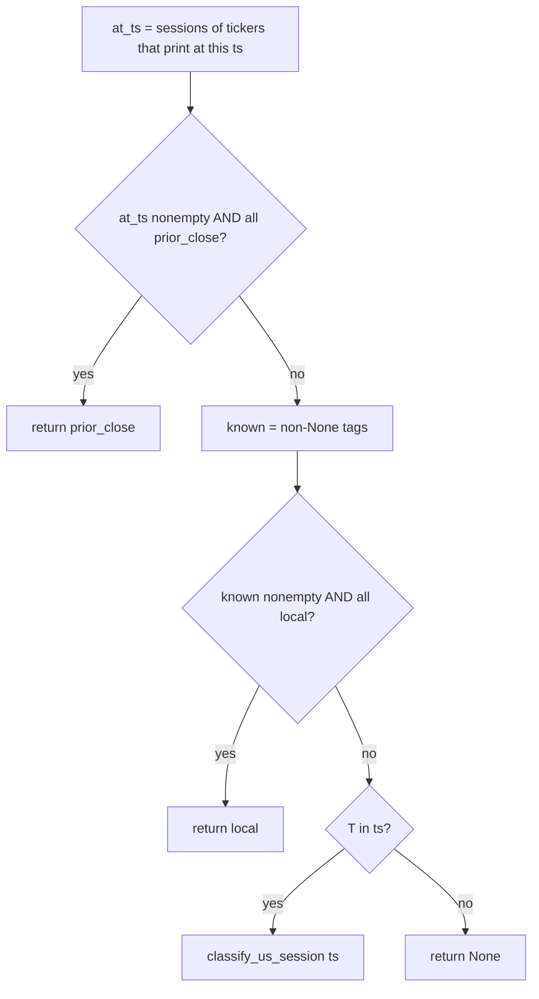
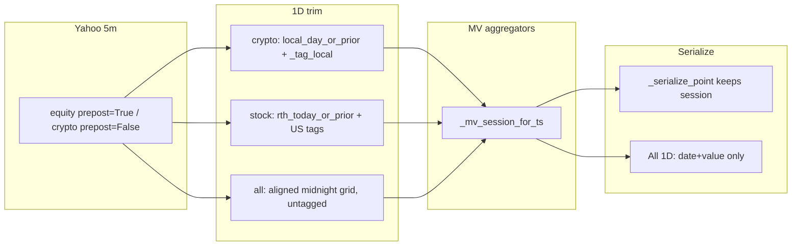
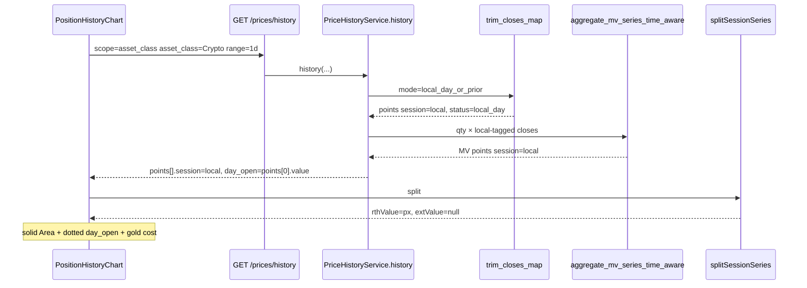

# Design: Restore crypto 1D solid chrome (ticker + Crypto book)

| Field | Value |
|-------|--------|
| **Document** | `docs/holdings-ux-research/CRYPTO_1D_SOLID_DESIGN.md` |
| **Author** | Design |
| **Date** | 2026-08-19 |
| **Status** | Draft |
| **Audience** | Senior engineers who know this repo |
| **Inputs** | User-approved product; verified code in `backend/services/price_history.py`, `frontend/src/lib/chartSessionSeries.ts`, `frontend/src/features/investments/PositionHistoryChart.tsx`; prior `PREPOST_1D_DESIGN.md`, `PRICE_HISTORY_DAY_WINDOWS_DESIGN.md` |
| **Out of scope** | Implementation in this pass (markdown only). No new endpoints. No mixed All restyle. No frontend force-solid. No FX invention. No Railway / `main` merge. |

---

## Overview

Equity 1D work (`PREPOST_1D_DESIGN.md`) correctly draws **RTH as a solid Area** and **pre / after-hours / prior-close seed as a dashed Line**. That chrome is driven by point `session` tags (`pre` | `rth` | `ah` | `prior_close`). Crypto **ticker** 1D was left on the local-midnight tape and is already tagged `session="local"`, so the chart stays a single solid Area.

Crypto **book** 1D (Holdings filter Crypto → `GET /prices/history?scope=asset_class&asset_class=Crypto&range=1d`) is local-midnight **trimmed**, then both market-value aggregators **overwrite** those `local` tags with `classify_us_session(ts)`. Prague midnight is `2026-08-09T22:00:00Z` = 18:00 ET → `"ah"`. The frontend treats that as a US tape: dashed `extValue`, overnight **gaps** where ET is outside 04:00–20:00, and `_day_change_from_series` parks `meta.day_open` on the first RTH print (~09:30 ET) instead of the midnight seed.

This design adds one helper, `_mv_session_for_ts(at_ts, ts)`, used by **both** aggregators. Crypto-only books keep `"local"`. Stocks still classify on the US clock. Mixed `scope=all` 1D stays an untagged, serialize-stripped solid path. No frontend change. No new endpoints.

---

## Background & Motivation

### Surfaces (verified)

| Surface | Request | 1D trim | Session after persist | Chart chrome today |
|---------|---------|---------|----------------------|--------------------|
| Crypto **ticker** | `scope=ticker&ticker=BTC&range=1d` | `trim_intraday_series(..., local_day_or_prior)` → `_tag_local` | `session="local"` via `_serialize_point` | Solid Area. **Correct.** |
| Crypto **book** | `scope=asset_class&asset_class=Crypto&range=1d` | `trim_closes_map(..., local_day_or_prior)` then **`aggregate_mv_series` / `aggregate_mv_series_time_aware`** | Aggregator **overwrites** with `classify_us_session` | Dashed + overnight holes + wrong `day_open`. **Bug.** |
| Stock ticker / Stocks book | ticker or `asset_class=Stock` | `rth_today_or_prior` | `prior_close` / `pre` / `rth` / `ah` | RTH solid + pre/AH dashed. **Keep.** |
| Mixed All | `scope=all&range=1d` | `build_portfolio_1d_aligned_closes` (untagged grid) | Serialize **strips** `session` (`points = [{date, value}]`) | Solid Area. **Do not change.** |

Holdings table filter Crypto is the same book: `syncAssetFilter.ts` `filterToChartAssetClass("crypto")` → chart scope `{ kind: "asset_class", asset_class: "Crypto" }` (`PositionHistoryChart.tsx` Crypto chip ~890–893).

There is **no** `_window_series_from_closes`. The overwrite lives only in the two MV aggregators.

### Current crypto ticker path (already correct)

```
history(scope=ticker, crypto)
  → trim_closes_map(mode="local_day_or_prior")   # price_history.py ~2392–2398
  → _tag_local                                   # ~247–248
  → _serialize_point (emits session="local")     # ~108–112, 2417
  → splitSessionSeries                           # chartSessionSeries.ts
       tagged? only if pre|rth|ah|prior_close
       "local" → not tagged → rthValue=px, extValue=null
  → solid Area, no dashed Line
```

Locked by `test_window_performance_1d_matches_history_trim` and `test_resolve_day_change_1d_uses_trimmed_series` (`test_price_history.py` ~1606–1731): Prague `day_open` is the midnight print, not a rolling 24h bar.

Frontend already documents this: `splitSessionSeries` comment *“Untagged / crypto tapes stay a solid Area”*; selftest asserts `session: "local"` → `extValue == null` (`chartSessionSeries.selftest.ts` 53–59).

### Current crypto book path (broken)

```
history(scope=asset_class, Crypto, 1d)
  → trim_closes_map(mode="local_day_or_prior")   # ~2604–2610 (and fallback ~2563–2570)
       each ticker: local-midnight cutoff + midnight seed + session="local"
       session_status = "local_day" | "prior_local_day"
  → aggregate_mv_series_time_aware (timeline)    # ~2615–2621
       or aggregate_mv_series (open-lots fallback) # ~2574–2576
  → BOTH overwrite session:                      # ~851–862 and ~1581–1592
       if all prior_close: "prior_close"
       elif "T" in ts: classify_us_session(ts)   # US pre/rth/ah/None
       else: None
  → _serialize_point keeps the US tag            # ~2665–2666 (not the All strip)
  → _day_change_from_series(mv_series)           # ~1859–1879
       tagged = any(session in pre|rth|ah|prior_close)
       day_open = first rth px   # ~09:30 ET, not midnight
```

`session_status` on the Crypto book is still `local_day` (from `trim_closes_map`, before aggregation). The **caption** already says “Today · Yahoo path”. Only the **path chrome** and **`day_open` line** are wrong.

### Smoking gun: Prague midnight is US after-hours

`classify_us_session` (`price_history.py` 216–226):

| ET clock | Tag |
|----------|-----|
| 04:00 ≤ t < 09:30 | `pre` |
| 09:30 ≤ t < 16:00 | `rth` |
| 16:00 ≤ t ≤ 20:00 | `ah` |
| else | `None` |

Europe/Prague CEST (UTC+2) midnight = `T22:00:00Z` = **18:00 ET** → `"ah"`.

A Prague-local crypto day then paints as:

| Prague clock | ET clock | Aggregator tag | Chart |
|--------------|----------|----------------|-------|
| 00:00–02:00 | 18:00–20:00 | `ah` | dashed `extValue` |
| 02:00–10:00 | 20:00–04:00 | `None` | **both `rthValue` and `extValue` null — hole** |
| 10:00–15:30 | 04:00–09:30 | `pre` | dashed |
| 15:30–22:00 | 09:30–16:00 | `rth` | solid Area |
| 22:00–02:00 next | 16:00–20:00 | `ah` | dashed |

`splitSessionSeries` (`chartSessionSeries.ts` 34–68) only treats a tape as “US tagged” when any point is `pre|rth|ah|prior_close`. On a tagged tape, `session=None` is neither RTH nor EXT → **invisible gap**. That is worse than “a bit of dash”: several hours of the Crypto book 1D path vanish.

### Why `day_open` moves to 09:30 ET

```1859:1879:backend/services/price_history.py
def _day_change_from_series(series: list[SeriesPoint], *, places: int = 2) -> dict[str, Any]:
    ...
    rth_open = next((p.px for p in series if p.session == "rth"), None)
    tagged = any(p.session in ("pre", "rth", "ah", "prior_close") for p in series)
    day_open_px = rth_open if tagged else first
```

`"local"` is **not** in that US set. Local-tagged series already use first print (midnight seed). US-retagged Crypto book series are `tagged=True`, so `day_open` becomes the first `rth` MV (~09:30 ET), not `series[0]`.

The chart draws that value as the faint horizontal dotted `ReferenceLine` (`PositionHistoryChart.tsx` 502–503, 1187–1193). Gold cost-basis `ReferenceLine` is independent (`shouldShowCostBasis` + `chartYDomain`) and is **not** the bug.

`extended_change_meta` (`~1894–1978`) sets `day_open` to first RTH and **nulls it before the bell**. Crypto 1D must **not** switch to that helper.

### Mixed All is already solid (leave it)

```2662:2666:backend/services/price_history.py
        # scope=all 1D stays untagged at book level (grid has no session).
        if ac_filter is None and is_intraday:
            points = [{"date": p.ts, "value": _str_dec(p.px, 2)} for p in mv_series]
        else:
            points = [_serialize_point(p, 2) for p in mv_series]
```

`build_portfolio_1d_aligned_closes` builds a shared local-midnight 5m grid **without** session tags. The aggregator may still stamp `classify_us_session` onto internal `SeriesPoint`s; serialize **drops** them. `splitSessionSeries` sees an untagged tape → solid. Product: **do not restyle mixed All. Do not stop stripping.**

### What did **not** regress

- Crypto ticker 1D chrome and `day_open` (no aggregator).
- Holdings Daily **per-ticker** crypto rows (`window_performance` trims per name, never aggregates MV).
- Gold cost line, book-vs-path meta, coverage threshold, quantity basis.
- Stock ticker / Stocks book extended tape.
- Cache keys (`phist:…:{tz}:ext1`). Session policy token stays; this is a tag-passthrough fix, not a new fetch policy.

---

## Goals & Non-Goals

### Goals

1. Crypto **ticker** 1D stays local-midnight, `session="local"`, solid Area, `day_open` = first print (midnight seed). Regression only.
2. Crypto **book** 1D (asset_class Crypto, including Holdings filter Crypto) is the same chrome: local-midnight cutoff, **solid** Area, **no** dashed pre/post path, `session="local"` on every serialized point.
3. Keep the faint horizontal **day-open** dotted line at `meta.day_open`, and keep `day_open` = first Crypto-book print (midnight seed), not first RTH.
4. Keep the gold cost-basis line as today (`shouldShowCostBasis` / `chartYDomain`).
5. Stock tickers + Stocks book: keep RTH solid + pre/AH dashed. Do not revert equity prepost.
6. Mixed All 1D: leave the serialize-untagged contract. Do not tag the aligned grid. Do not restyle.
7. One helper shared by **both** aggregators. No `_window_series_from_closes`. No new endpoints. No frontend change unless a later review proves backend tags are insufficient (they are not).
8. Tests on InMemory + fixtures. No live yfinance. Decimal money.
9. `docs/BUILD_LOG.md` note: crypto book MV no longer US-tags sessions.

### Non-Goals

- Restyling mixed All (stocks + crypto combined 1D), even if crypto tags later reach the grid.
- Frontend “force solid when `session_status` is `local_day`” (YAGNI; see Alternatives).
- Switching crypto 1D to `extended_change_meta` / vs-close / vs-open dual headline.
- Changing `classify_us_session` bounds, Yahoo `prepost`, or equity 5m fetch.
- Tagging `build_portfolio_1d_aligned_closes` or changing All serialize.
- New cache key / new route / Sheets schema / FX / import / tax / FIFO.
- Classic `HoldingsTable`. Light-theme chrome. User toggle “RTH only.”

---

## Proposed Design

### Decision tree (binding)

Add `_mv_session_for_ts` next to the aggregators in `backend/services/price_history.py` (after `classify_us_session` / before `aggregate_mv_series` is fine; one definition, two call sites).

```python
def _mv_session_for_ts(
    at_ts: Sequence[SessionTag | None],
    ts: str,
) -> SessionTag | None:
    """Session for one aggregated MV bar.

    prior_close wins only when every contributor at this ts is the seed.
    local wins only when every *known* contributor is local (crypto-only book).
    Mixed / untagged intraday falls through to the US clock.
    """
    if at_ts and all(s == "prior_close" for s in at_ts):
        return "prior_close"
    known = [s for s in at_ts if s is not None]
    if known and all(s == "local" for s in known):
        return "local"
    if "T" in ts:
        return classify_us_session(ts)
    return None
```

Replace the duplicated blocks at `aggregate_mv_series` ~856–861 and `aggregate_mv_series_time_aware` ~1586–1591 with:

```python
sess = _mv_session_for_ts(at_ts, ts)
result.append(SeriesPoint(ts, _q2(total), sess))  # or _q2(total_mv)
```

`at_ts` collection is unchanged: tags of contributors that **print at this ts** (not forward-filled names).



### Why this exact order

| Case | Inputs at `ts` | Result | Why |
|------|----------------|--------|-----|
| Stock seed bar | all `prior_close` | `prior_close` | Yesterday 15:55 would otherwise classify as `rth`. Existing special case, first. |
| Crypto-only book | all `local` (trim already tagged) | `local` | **The fix.** Frontend keeps `extValue=null`. |
| Crypto-only, some `None` + rest `local` | `known` all `local` | `local` | Forward-fill / sparse Yahoo must not flip a crypto-only book to US. |
| Mixed union | `local` + `pre`/`rth`/`ah` | US classify | **Do not prefer local.** Would restyle All if crypto tags ever reach the grid. |
| Mixed All today | all `None` (untagged grid) | US classify internally, then **serialize strips** | Chart stays solid. Leave as-is. |
| Stocks live bar | `pre`/`rth`/`ah` | US classify | Equity chrome unchanged. |
| Daily (no `T`) | dates | `None` | Multi-day books stay untagged. |

**Do not** prefer local when *any* known tag is local. That would paint a mixed book as a 24h solid crypto day.

**Do not** require `all(s == "local" for s in at_ts)` including `None`. A crypto-only book with one untagged contributor would fall through to US classify and recreate the bug.

### Data flow after the change





### `day_open` (keep the line; fix the value)

After local tags survive aggregation:

- `_resolve_day_change` on 1D already passes `main_series=mv_series` (`~2718–2737`).
- `_day_change_from_series` sees no US tags → `day_open = series[0].px` = midnight seed.
- Crypto ticker already uses this path (`~2434–2443`), not `extended_change_meta`.
- Chart `ReferenceLine y={dayOpenY}` stays.

**Do not** route Crypto book 1D through `extended_change_meta`. That helper nulls `day_open` until the first `rth` print and would remove the dotted line for most of a Prague morning.

Headline Δ for the Crypto book stays first→last of the MV series (`performance_change_meta`). Vertices were always the local-midnight tape; only tags and `day_open` were wrong. After this change, the dotted line sits on the same first vertex the headline already uses.

### Frontend (no change)

`splitSessionSeries` already treats `session="local"` as an untagged / crypto tape:

```27:48:frontend/src/lib/chartSessionSeries.ts
export function splitSessionSeries(points: readonly SessionPoint[]): SplitSessionRow[] {
  ...
  const tagged = rows.some(
    (p) =>
      p.session === "pre" ||
      p.session === "rth" ||
      p.session === "ah" ||
      p.session === "prior_close",
  );
  if (!tagged) {
    return rows.map((p) => ({
      ...
      rthValue: Number.isFinite(p.value) ? p.value : null,
      extValue: null,
      ...
    }));
  }
```

`ChartSessionTag` and `PriceHistoryPoint.session` already include `"local"` (`frontend/src/api/types.ts` 578; `backend/api/schemas.py` 134). Caption already keys off `session_status === "local_day"` (`PositionHistoryChart.tsx` 119–141, 172–175). Dual vs-close / vs-open is ticker-price 1D only and already excludes local-day (`chartChangeHeadline.ts` 89–92).

A UI force-solid (`if session_status === "local_day" ignore point sessions`) would hide this class of backend bug and is **YAGNI**.

### Cache / invalidation

No new cache token. Response body session tags change; existing 1D TTL (~45s, `phist:…:{tz}:ext1`) plus the usual mutate invalidation (upload, price refresh, `prices-updated`) is enough. Do not bump `extended_v1` — fetch policy is unchanged.

### Layering

Helper lives in `backend/services/price_history.py` next to the aggregators it serves. No route logic. No Sheets writes. No frontend domain math. Matches Agents.md: services own the use-case; UI displays API tags.

---

## API / Interface Changes

**None.** Same `GET /prices/history` and `GET /prices/window-performance`.

| Field | Crypto ticker 1D (unchanged) | Crypto book 1D **before** | Crypto book 1D **after** |
|-------|------------------------------|---------------------------|--------------------------|
| `points[].session` | `"local"` | `"ah"` / `"pre"` / `"rth"` / omitted (`None`) | `"local"` |
| `meta.session_status` | `local_day` / `prior_local_day` | already `local_day` | unchanged |
| `meta.day_open` | first point (midnight) | first `rth` MV (~09:30 ET) | first point (midnight) |
| `meta.day_policy.mode` | `local_day_or_prior` | already | unchanged |
| Mixed All `points[].session` | — | absent | **absent** (still stripped) |

`window_performance` is per-ticker and already correct for crypto. No contract change.

---

## Data Model Changes

None. `SeriesPoint.session` and `SessionTag` already include `"local"` (`price_history.py` 59, 62–68). No Sheets tabs, no migration, no new Pydantic fields.

---

## Tests

All InMemory. Mocked fetcher. **No live yfinance.** Assert `Decimal` / quantized strings. Add to `backend/tests/test_price_history.py` (reuse `_lot`, `_event`, `_five_min_series`, `sp` / `SeriesPoint`).

### 1. Aggregator: local-tagged BTC 5m including Prague midnight

Construct a crypto-only book (BTC qty 1) whose input series is already `session="local"` and includes `2026-08-09T22:00:00+00:00` (Prague midnight, 18:00 ET). Include at least one 09:30 ET bar so a US classify would emit `rth`.

Call **both** `aggregate_mv_series` and `aggregate_mv_series_time_aware`.

Assert every emitted point has `session == "local"`. In particular the midnight bar is **not** `"ah"` and the 09:30 ET bar is **not** `"rth"`.

Time-aware needs a `HoldingsTimeline` with a BTC buy dated before the window (same pattern as `test_portfolio_1d_grid_from_local_midnight`).

Optional negative: same timestamps **without** local tags (all `None`) still classify US (`T22:00Z` → `"ah"`). Proves the helper does not invent local on an untagged tape.

### 2. `history(scope=asset_class, Crypto, 1d)`

InMemory lot + event for BTC. Fetcher returns 5m from before Prague midnight through afternoon (include `T22:00Z` and a 13:30Z / 09:30 ET print). `now=2026-08-10 13:00 UTC`, `zone=Europe/Prague`.

Assert:

- `meta["session_status"] == "local_day"`
- every `points[i]["session"] == "local"`
- `meta["day_open"] == points[0]["value"]`
- `meta["day_open"]` equals the midnight seed value, **not** the 09:30 ET print

Prefer the timeline path (events present) so this hits `aggregate_mv_series_time_aware`. A second case with lots only / empty timeline is nice-to-have (hits `aggregate_mv_series` fallback) but not required if test 1 already covers both aggregators.

### 3. Ticker BTC 1D regression

Extend `test_resolve_day_change_1d_uses_trimmed_series` (or a sibling):

- still `day_open == "80.0000"` (midnight), not `"50.0000"`
- every point `session == "local"`
- `session_status == "local_day"`

Do not weaken existing identity with `window_performance`.

### 4. Stock class 1D still US-tagged

`history(scope=asset_class, Stock, 1d)` with `_stock_extended_bars()` and `now` in regular session (e.g. Mon 10:00 ET).

Assert serialized sessions are a subset of `{prior_close, pre, rth, ah}` (no `"local"`), and at least one `prior_close` plus one live US tag exist. Path still has dashed chrome inputs.

### 5. Mixed All 1D serialized points have **no** session

`history(scope=all, range_key=1d)` with one stock + one crypto, mocked 5m, frozen `now`.

Assert `"session" not in p` for every point (or `p.get("session") is None`). Do **not** start emitting `local` or US tags on All.

### 6. `_day_change_from_series` local-tagged → `day_open` is first px

Direct unit test, no service:

```python
series = [
    SeriesPoint("2026-08-09T22:00:00+00:00", Decimal("80.00"), "local"),
    SeriesPoint("2026-08-10T13:30:00+00:00", Decimal("90.00"), "local"),  # 09:30 ET
    SeriesPoint("2026-08-10T12:55:00+00:00", Decimal("91.00"), "local"),
]
meta = _day_change_from_series(series, places=2)
assert meta["day_open"] == "80.00"
```

Contrast (optional, documents why we must not US-tag): same prices tagged `ah` / `rth` / `rth` → `day_open == "90.00"`.

Do **not** call `extended_change_meta` on crypto fixtures in these tests.

Frontend: existing `chartSessionSeries.selftest.ts` already locks `local` → solid. No new UI test required.

---

## Alternatives Considered

### A. Frontend force-solid when `session_status` is `local_day` / scope is Crypto — **rejected (YAGNI)**

Ignore `points[].session` and always draw `rthValue` if the book caption is local-day.

| | |
|--|--|
| Pros | One-line UI fix; no backend touch. |
| Cons | Leaves `day_open` on first RTH (dotted line still wrong). Hides the next aggregator bug. Mixed All is already solid via strip — this would not be scoped cleanly. Violates “frontend does not redefine session meaning.” |

Product: **no frontend change** if backend tags are `"local"`.

### B. Pass through the first contributor’s tag / “any local wins” — **rejected**

| | |
|--|--|
| Pros | Fewer branches. |
| Cons | Order-dependent. Mixed union with a crypto print at `ts` would stamp `local` on a stocks+crypto MV bar. If All later stops stripping, the combined 1D chart would lose dashed equity chrome. Product explicitly forbids preferring local on mixed union. |

### C. Stop overwriting: copy a single input tag, never classify — **rejected**

| | |
|--|--|
| Pros | Crypto book would keep `local` automatically. |
| Cons | Stocks book today **re-classifies** live bars. Untagged 5m (raw fetch, tests that pass tuples) would lose `pre/rth/ah` and the dashed Line. `prior_close` still needs the all-seed special case. Classification on `"T" in ts` is the right fallback for equity and for untagged grids. |

### D. Tag the All grid and restyle mixed 1D — **rejected (product)**

User-approved: do **not** restyle mixed All. Leave serialize-untagged. A later All chrome project is a different design.

### E. Switch crypto 1D to `extended_change_meta` — **rejected**

Would null `day_open` until 09:30 ET and invent vs-close on a 24h market. Product keeps the midnight dotted line.

**Chosen:** Alternative is not needed — `_mv_session_for_ts` as specified. Smallest change that restores Crypto book chrome without touching All or the frontend.

---

## Security & Privacy Considerations

- No new endpoints, no auth change, `UserDep` on existing `/prices/history` stays.
- No new secrets, no statement contents in logs.
- Log the helper at **debug** only if at all (ticker count + chosen tag). Do not log full series.
- Threat: none beyond existing Yahoo/cache surface. Severity of a wrong tag is display-only (no ledger write).

---

## Observability

| Signal | Where | Notes |
|--------|-------|--------|
| Existing `session_status` | `meta.session_status` / `day_policy` | Crypto book already `local_day`; unchanged. |
| Point tags | `points[].session` | After fix, Crypto book is all `local`. |
| Failures | existing `logger.warning` on day-change / window components | Do not add a new metric for this slice. |

No new alert. Lab visual check: Holdings → Crypto → 1D should be a continuous solid area from ~00:00 local with a dotted line on the first vertex.

---

## Rollout Plan

1. **One PR** (this is a small vertical: helper + two call sites + tests + BUILD_LOG). See summary PR Plan.
2. No feature flag. Tag semantics are already in the contract; we stop corrupting them.
3. Deploy with the usual API bounce. 1D cache TTL expires in <1 minute; hard refresh / price refresh also invalidates.
4. **Rollback:** revert the PR. Aggregators return to US classify. No schema to undo.
5. Verify on lab: Crypto ticker 1D (unchanged), Crypto book 1D (solid + midnight `day_open`), Stocks 1D (still dashed extended), Portfolio 1D (still solid untagged).

---

## Risks

| Risk | Severity | Mitigation |
|------|----------|------------|
| Crypto book still dashed because a test/fixture forgets to trim before aggregate | Medium | Test 2 goes through `history()` (trim + aggregate). Test 1 uses explicit `session="local"` inputs. |
| Mixed All accidentally emits `session` | Medium | Test 5. Do not touch the All serialize branch (~2662–2664). Do not prefer local on mixed known tags. |
| Preferring local on `known` all-local when All later tags only crypto legs | Low | All serialize still strips. If a future PR stops stripping, mixed known tags (`local` + US) fall through to classify — still not a crypto-styled All. Document that All must stay untagged or be a new design. |
| Using `extended_change_meta` on crypto “for consistency” | High (product) | Tests 2, 3, 6 lock `day_open` = first local print. Code review: crypto ticker / book stay on `_day_change_from_series`. |
| Stock book loses `prior_close` | High | Helper keeps the all-`prior_close` branch first. Test 4. |
| Overnight `None` holes remain on Crypto book | High (the bug) | Local passthrough means `splitSessionSeries` never enters the US-tagged branch. Test 1+2. |
| N+1 / extra Yahoo | None | No new fetch. Same closes map. |

---

## Open Questions

None blocking. Product choices are user-approved:

1. Mixed All stays serialize-untagged — **closed**.
2. No frontend force-solid — **closed**.
3. Keep `day_open` line; value = midnight first print — **closed**.
4. One helper, both aggregators — **closed**.

Non-blocking (out of this slice): a future All 1D chrome (stock dashed + crypto solid on one combined path) would need a tagged grid **and** a frontend that can split mixed sessions. Explicitly not this PR.

---

## References

- `backend/services/price_history.py` — `classify_us_session` (216), `_tag_local` (247), `trim_intraday_series` (393), `aggregate_mv_series` (772 / overwrite 856–861), `aggregate_mv_series_time_aware` (1468 / overwrite 1586–1591), `_day_change_from_series` (1859), `extended_change_meta` (1894), `history` ticker (2382) / book (2508) / All serialize (2662).
- `backend/api/schemas.py` — `PriceHistoryPoint.session` includes `"local"` (134).
- `frontend/src/lib/chartSessionSeries.ts` + `.selftest.ts` — local → solid.
- `frontend/src/features/investments/PositionHistoryChart.tsx` — Area `rthValue`, Line `extValue`, day-open + cost `ReferenceLine`.
- `frontend/src/features/investments/next/syncAssetFilter.ts` — Holdings Crypto filter → asset_class Crypto.
- `docs/holdings-ux-research/PREPOST_1D_DESIGN.md` — equity dashed chrome (do not revert).
- `docs/PRICE_HISTORY_DAY_WINDOWS_DESIGN.md` — crypto local calendar day.
- `docs/BUILD_LOG.md` — 2026-08-19 equity extended tape; 2026-08-18 crypto local day.
- `Agents.md` — Decimal, no invented FX, statements-only, no new god-modules, tests InMemory.

---

## BUILD_LOG entry (ship with the implementation PR)

```
## 2026-08-19 — Crypto book 1D keeps local session tags

- Crypto ticker 1D was already `session=local` (trim → serialize). Crypto **book**
  MV ran the same local-midnight trim, then `aggregate_mv_series` /
  `aggregate_mv_series_time_aware` overwrote tags with `classify_us_session`.
  Prague midnight (`T22:00Z` = 18:00 ET) became `ah`; overnight ET hours became
  `None` (chart holes); `day_open` jumped to first RTH.
- Both aggregators now call `_mv_session_for_ts`: all `prior_close` → seed;
  all known tags `local` → `local` (crypto-only book); else US classify.
  Mixed All 1D still serialize-strips `session`. No frontend change.
```
